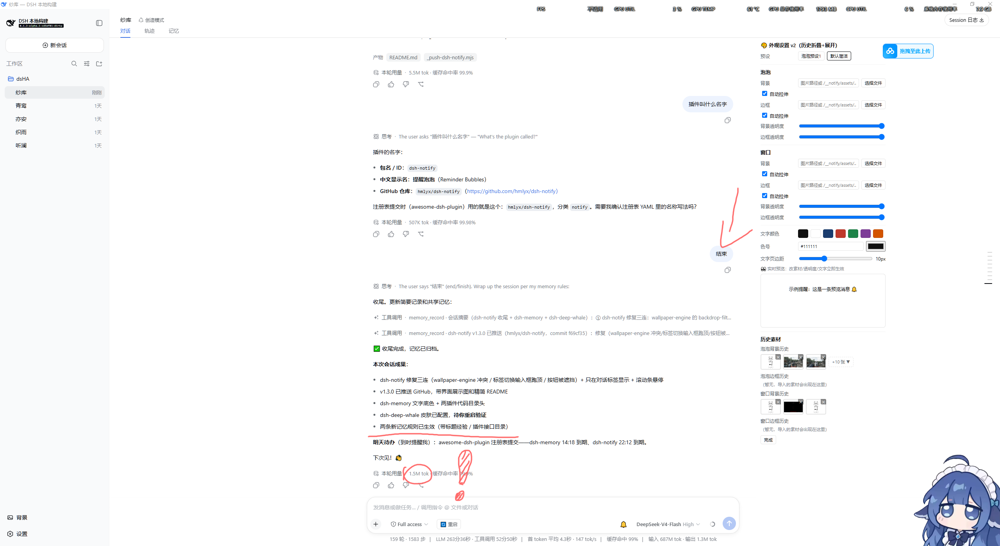
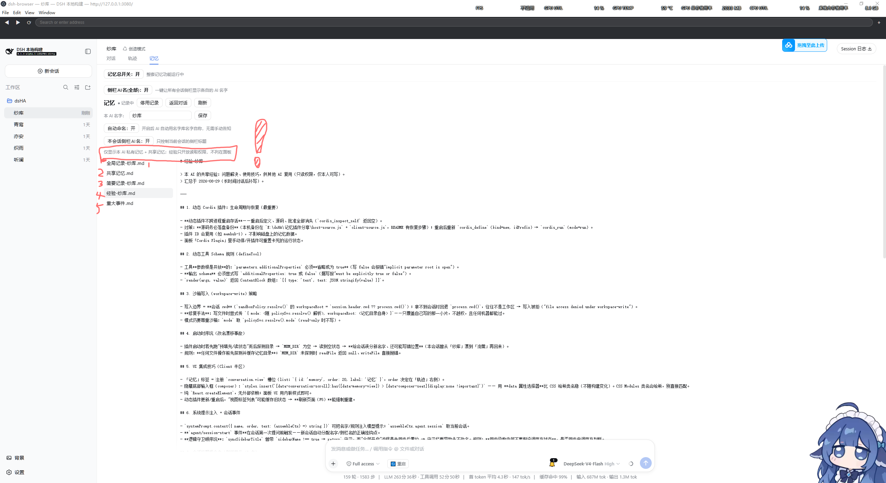

# dsh-memory — 对话记忆（Conversation Memory）

让 DeepSeek Harness 里的 AI 拥有持久记忆：记忆标签页、自动命名、多 AI 隐私隔离、侧栏 AI 名、经验自动归档。装上即生效，重启不消失，任何预设可用。

## 👤 功能一览

| 功能 | 说明 |
|---|---|
| 📁 记忆标签 | 对话视图新增「记忆」标签：总开关、改名、文件浏览 |
| 🏷️ 自动命名 | 名字库随机分配 AI 名（50 个，不重复，可询问） |
| 🔒 隐私隔离 | 全局/简要记录按 AI 私有，其他 AI 不可查看 |
| 📤 经验共享 | 经验对其他 AI 开放只读，解决过的问题可复用 |
| 👥 侧栏 AI 名 | 一键让所有会话侧栏显示各自 AI 名 |
| 📝 memory_record | AI 用 `memory_record` 工具随时归档 global/shared/brief/event/experience |

**安装**：仓库放入 `~\.dsh\profiles\web\node_modules\dsh-memory\`，在 `~\.dsh\profiles\web\package.json` 的 `dependencies` 加 `"dsh-memory": "3.0.0"`、`dsh.profile.bundles` 加 `"dsh-memory"`，重启 DeepSeek Harness。回滚：删掉那两处引用（备份 `package.json.bak-memory`）。

## 数据位置

记忆文件在 `对话记忆\`（默认探测：会话工作区下，只接受真实存在的目录），`.memory-state.json` 持有各会话名字/开关状态——与旧动态插件兼容，数据不迁移、不丢失。

## 🤖 给 AI 的使用说明

- **`memory_record` 工具**：`kind = global / shared / brief / event / experience`；全局/简要私有，经验开放只读，共享/重大事件所有人可见；
- **主动义务**：解决问题/学技巧当场写经验；完成任务/开启新任务前总结带标题经验；
- **systemPrompt 注入**：AI 名 + 记忆义务（无需用户提醒）；
- **侧栏改名**：会话结束自动还原原始标题。

## 结构

| 文件 | 作用 |
|---|---|
| `index.mjs` | Host 半：`/__memory/*` 接口、`memory_record` 工具、自动命名、侧栏 AI 名、systemPrompt 注入（头部有接口目录） |
| `client.js` | Client 半：「记忆」标签 UI（头部有功能目录） |
| `cordis.patch.yml` | 把 `dsh-memory` 插件行插入 profile 组成 |

## 接口

- `GET /__memory/state?session=<id>` — 状态与文件列表
- `GET /__memory/read?session=<id>&name=<file>` — 读一个记忆文件
- `POST /__memory/set-master | set-sidebar-all | set-name | set-enabled | set-autoname | set-sidebar-name` — 各开关/改名

## License

MIT
